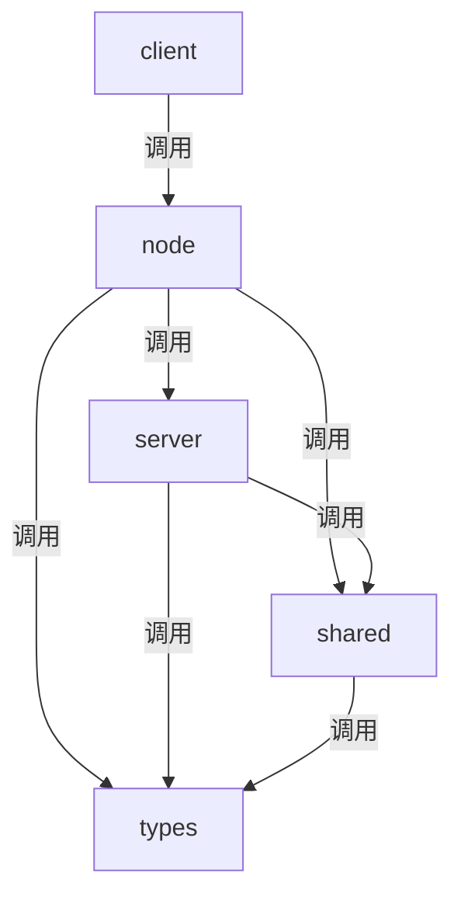

好的，以下是 `vitejs/vite` 仓库中 `src` 目录下各个包的调用关系及其作用的图解。

### 目录结构

```plaintext
vitejs/vite
├── src
│   ├── client
│   ├── node
│   ├── server
│   ├── shared
│   ├── types
│   └── ...
```

### Mermaid 图解



### 作用说明

1. **client**:
   - 作用：主要用于客户端功能，包括热模块替换（HMR）、环境变量注入等。
   - 主要文件：
     - `client.ts`: 客户端入口文件，处理 WebSocket 连接和 HMR 消息。
     - `env.ts`: 注入和处理环境变量。
     - `overlay.ts`: 显示错误覆盖层。
     - `hot.ts`: 定义 HMR API。

2. **node**:
   - 作用：主要用于 Node.js 环境下的功能，包括服务器启动、构建、插件处理等。
   - 主要文件：
     - `server.ts`: 服务器端入口文件，启动开发服务器。
     - `build.ts`: 处理构建逻辑。
     - `config.ts`: 加载和解析配置。
     - `plugin` 目录: 包含各种插件（如 `html.ts`、`css.ts`、`esbuild.ts` 等）。

3. **server**:
   - 作用：处理服务器相关的功能，主要用于开发服务器和生产服务器的配置和启动。
   - 主要文件：
     - `index.ts`: 服务器入口文件。
     - `middleware.ts`: 定义中间件。
     - `ws.ts`: 处理 WebSocket 连接。

4. **shared**:
   - 作用：包含共享的工具函数和常量，供其他模块使用。
   - 主要文件：
     - `utils.ts`: 各种工具函数。
     - `constants.ts`: 定义常量。

5. **types**:
   - 作用：包含 TypeScript 类型定义，供整个项目使用。
   - 主要文件：
     - `index.d.ts`: 类型定义入口文件。

### 调用关系说明

- `client` 目录下的文件主要用于处理客户端逻辑，如 HMR 和环境变量注入。
- `node` 目录下的文件主要用于处理服务器端逻辑，如服务器启动、构建和插件处理。
- `server` 目录下的文件主要用于处理服务器相关的功能，如中间件和 WebSocket 连接。
- `shared` 目录下的文件包含共享的工具函数和常量，供其他模块使用。
- `types` 目录下的文件包含 TypeScript 类型定义，供整个项目使用。

通过以上图解和说明，可以更好地理解 `vitejs/vite` 仓库中 `src` 目录下各个包的调用关系和作用。