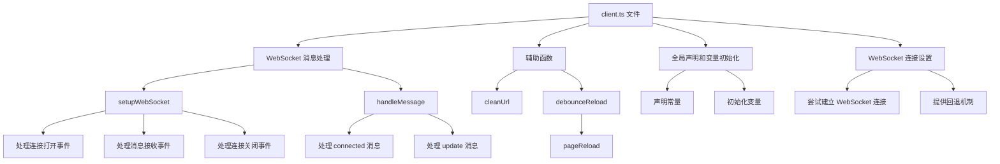

以下是 `packages/vite/src/client/client.ts` 文件中每个函数的详细说明和作用。

### Mermaid 图解



### 每个函数的作用

#### 1. 全局声明和变量初始化

```ts
declare const __BASE__: string;
declare const __SERVER_HOST__: string;
declare const __HMR_PROTOCOL__: string | null;
declare const __HMR_HOSTNAME__: string | null;
declare const __HMR_PORT__: number | null;
declare const __HMR_DIRECT_TARGET__: string;
declare const __HMR_BASE__: string;
declare const __HMR_TIMEOUT__: number;
declare const __HMR_ENABLE_OVERLAY__: boolean;

console.debug('[vite] connecting...');

const importMetaUrl = new URL(import.meta.url);
const serverHost = __SERVER_HOST__;
const socketProtocol = __HMR_PROTOCOL__ || (importMetaUrl.protocol === 'https:' ? 'wss' : 'ws');
const hmrPort = __HMR_PORT__;
const socketHost = `${__HMR_HOSTNAME__ || importMetaUrl.hostname}:${hmrPort || importMetaUrl.port}${__HMR_BASE__}`;
const directSocketHost = __HMR_DIRECT_TARGET__;
const base = __BASE__ || '/';
```

- **声明常量**：声明了一些全局常量，如 `__BASE__`、`__SERVER_HOST__` 等，用于配置 WebSocket 连接的参数。
- **初始化变量**：初始化了一些变量，如 `importMetaUrl`、`serverHost`、`socketProtocol` 等，用于后续的 WebSocket 连接设置。

#### 2. WebSocket 连接设置

```ts
let socket: WebSocket;
try {
  let fallback: (() => void) | undefined;
  if (!hmrPort) {
    fallback = () => {
      socket = setupWebSocket(socketProtocol, directSocketHost, () => {
        const currentScriptHostURL = new URL(import.meta.url);
        const currentScriptHost = currentScriptHostURL.host + currentScriptHostURL.pathname.replace(/@vite\/client$/, '');
        console.error(
          '[vite] failed to connect to websocket.\n' +
          'your current setup:\n' +
          `  (browser) ${currentScriptHost} <--[HTTP]--> ${serverHost} (server)\n` +
          `  (browser) ${socketHost} <--[WebSocket (failing)]--> ${directSocketHost} (server)\n` +
          'Check out your Vite / network configuration and https://vitejs.dev/config/server-options.html#server-hmr .',
        );
      });
      socket.addEventListener('open', () => {
        console.info('[vite] Direct websocket connection fallback. Check out https://vitejs.dev/config/server-options.html#server-hmr to remove the previous connection error.');
      }, { once: true });
    };
  }
  socket = setupWebSocket(socketProtocol, socketHost, fallback);
} catch (error) {
  console.error(`[vite] failed to connect to websocket (${error}). `);
}
```

- **尝试建立 WebSocket 连接**：尝试通过 `setupWebSocket` 函数建立 WebSocket 连接。
- **提供回退机制**：如果连接失败，提供一个回退机制，尝试使用备用的 WebSocket 连接。

#### 3. WebSocket 消息处理

```ts
function setupWebSocket(protocol: string, hostAndPath: string, onCloseWithoutOpen?: () => void) {
  const socket = new WebSocket(`${protocol}://${hostAndPath}`, 'vite-hmr');
  let isOpened = false;

  socket.addEventListener('open', () => {
    isOpened = true;
    notifyListeners('vite:ws:connect', { webSocket: socket });
  }, { once: true });

  socket.addEventListener('message', async ({ data }) => {
    handleMessage(JSON.parse(data));
  });

  socket.addEventListener('close', async ({ wasClean }) => {
    if (wasClean) return;

    if (!isOpened && onCloseWithoutOpen) {
      onCloseWithoutOpen();
      return;
    }

    notifyListeners('vite:ws:disconnect', { webSocket: socket });

    if (hasDocument) {
      console.log(`[vite] server connection lost. Polling for restart...`);
      await waitForSuccessfulPing(protocol, hostAndPath);
      location.reload();
    }
  });

  return socket;
}
```

- **setupWebSocket**：设置 WebSocket 连接，处理连接打开、消息接收和连接关闭事件。
  - **处理连接打开事件**：在 WebSocket 连接打开时，触发相应的事件通知。
  - **处理消息接收事件**：在接收到 WebSocket 消息时，调用 `handleMessage` 函数处理消息。
  - **处理连接关闭事件**：在 WebSocket 连接关闭时，处理连接断开逻辑，并尝试重新连接。

```ts
async function handleMessage(payload: HMRPayload) {
  switch (payload.type) {
    case 'connected':
      console.debug(`[vite] connected.`);
      hmrClient.messenger.flush();
      setInterval(() => {
        if (socket.readyState === socket.OPEN) {
          socket.send('{"type":"ping"}');
        }
      }, __HMR_TIMEOUT__);
      break;
    case 'update':
      notifyListeners('vite:beforeUpdate', payload);
      if (hasDocument) {
        if (isFirstUpdate && hasErrorOverlay()) {
          window.location.reload();
          return;
        } else {
          if (enableOverlay) {
            clearErrorOverlay();
          }
          isFirstUpdate = false;
        }
      }
      await Promise.all(
        payload.updates.map(async (update): Promise<void> => {
          if (update.type === 'js-update') {
            return hmrClient.queueUpdate(update);
          }

          const { path, timestamp } = update;
          const searchUrl = cleanUrl(path);
          const el = Array.from(document.querySelectorAll<HTMLLinkElement>('link')).find(
            (e) => !outdatedLinkTags.has(e) && cleanUrl(e.href).includes(searchUrl),
          );

          if (!el) {
            return;
          }

          const newPath = `${base}${searchUrl.slice(1)}${searchUrl.includes('?') ? '&' : '?'}t=${timestamp}`;
          el.href = newPath;
        }),
      );
      break;
  }
}
```

- **handleMessage**：处理不同类型的 HMR 消息，包括 `connected` 和 `update` 消息。
  - **处理 connected 消息**：在收到 `connected` 消息时，进行一些初始化操作。
  - **处理 update 消息**：在收到 `update` 消息时，更新相应的模块或资源。

#### 4. 辅助函数

```ts
function cleanUrl(pathname: string): string {
  const url = new URL(pathname, 'http://vitejs.dev');
  url.searchParams.delete('direct');
  return url.pathname + url.search;
}
```

- **cleanUrl**：清理 URL，删除不必要的查询参数。

```ts
const debounceReload = (time: number) => {
  let timer: ReturnType<typeof setTimeout> | null;
  return () => {
    if (timer) {
      clearTimeout(timer);
      timer = null;
    }
    timer = setTimeout(() => {
      location.reload();
    }, time);
  };
};
const pageReload = debounceReload(50);
```

- **debounceReload**：防抖函数，用于防止页面频繁重载。
  - **pageReload**：具体的页面重载逻辑，使用防抖机制防止频繁重载。