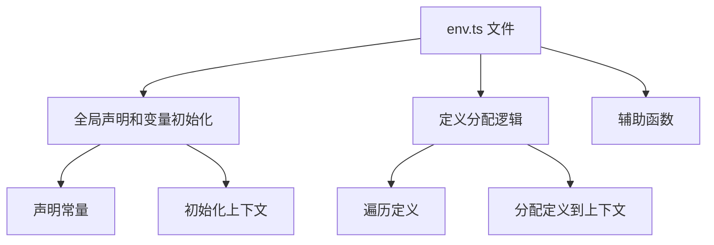

### 文件结构概览

1. **全局声明和变量初始化**
2. **定义分配逻辑**
3. **辅助函数**

### 详细说明

#### 1. 全局声明和变量初始化

```ts
declare const __MODE__: string;
declare const __DEFINES__: Record<string, any>;

const context = (() => {
  if (typeof globalThis !== 'undefined') {
    return globalThis;
  } else if (typeof self !== 'undefined') {
    return self;
  } else if (typeof window !== 'undefined') {
    return window;
  } else {
    return Function('return this')();
  }
})();
```

这些声明和变量初始化用于配置环境变量的上下文，包括 `__MODE__` 和 `__DEFINES__`。

#### 2. 定义分配逻辑

```ts
const defines = __DEFINES__;
Object.keys(defines).forEach((key) => {
  const segments = key.split('.');
  let target = context;
  for (let i = 0; i < segments.length; i++) {
    const segment = segments[i];
    if (i === segments.length - 1) {
      target[segment] = defines[key];
    } else {
      target = target[segment] || (target[segment] = {});
    }
  }
});
```

这段代码用于将 `__DEFINES__` 中的定义分配到全局上下文中，确保这些定义可以在全局范围内访问。

### Mermaid 图解



### 每个部分的作用

#### 1. 全局声明和变量初始化

```ts
declare const __MODE__: string;
declare const __DEFINES__: Record<string, any>;

const context = (() => {
  if (typeof globalThis !== 'undefined') {
    return globalThis;
  } else if (typeof self !== 'undefined') {
    return self;
  } else if (typeof window !== 'undefined') {
    return window;
  } else {
    return Function('return this')();
  }
})();
```

- **声明常量**：声明了 `__MODE__` 和 `__DEFINES__` 两个全局常量，用于存储当前模式和定义的环境变量。
- **初始化上下文**：初始化了 `context` 变量，用于确定当前的全局上下文（如 `globalThis`、`self`、`window` 等）。

#### 2. 定义分配逻辑

```ts
const defines = __DEFINES__;
Object.keys(defines).forEach((key) => {
  const segments = key.split('.');
  let target = context;
  for (let i = 0; i < segments.length; i++) {
    const segment = segments[i];
    if (i === segments.length - 1) {
      target[segment] = defines[key];
    } else {
      target = target[segment] || (target[segment] = {});
    }
  }
});
```

- **遍历定义**：遍历 `__DEFINES__` 对象的所有键。
- **分配定义到上下文**：将每个定义按照键的层级结构分配到全局上下文中，确保这些定义可以在全局范围内访问。