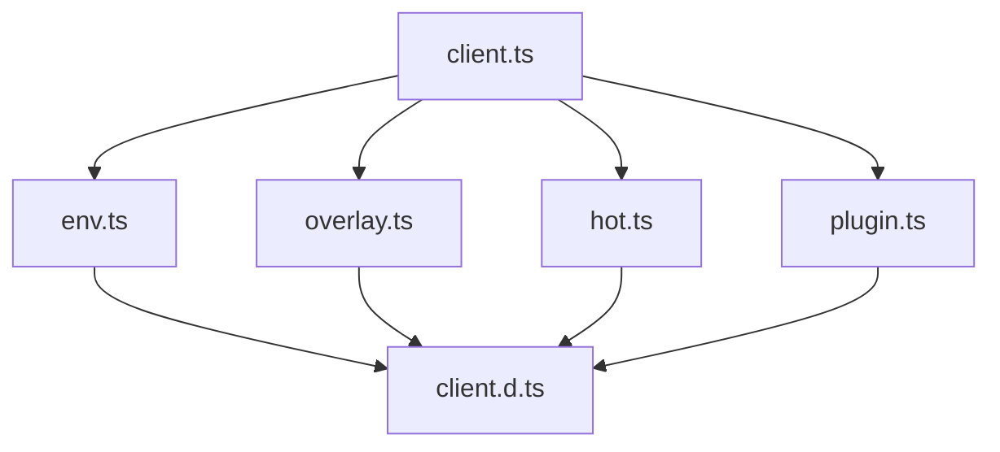

`packages/vite/src/client` 目录下的文件主要用于 Vite 的客户端功能，包括热模块替换（HMR）、环境变量注入等。以下是该目录下主要文件的解析及其作用：

1. **client.ts**:
   - 这是 Vite 客户端的主要入口文件，负责处理与开发服务器的 WebSocket 连接，用于实现热模块替换（HMR）功能。
   - 该文件包含了 WebSocket 的连接逻辑、消息处理以及连接失败后的重试机制。
   - 主要功能包括：
     - 设置 WebSocket 连接并处理连接事件（如打开、消息接收、关闭等）[5](https://github.com/vitejs/vite/blob/main/packages/vite/src/client/client.ts)。
     - 处理从服务器接收到的 HMR 消息并执行相应的操作，如模块更新、页面重载等[6](https://github.com/vitejs/vite/blob/main/packages/vite/src/client/client.ts)。

2. **env.ts**:
   - 该文件用于注入和处理环境变量。
   - 它定义了一些全局常量（如 `__MODE__` 和 `__DEFINES__`），并将这些常量注入到全局上下文中。
   - 主要功能包括：
     - 根据不同的上下文（如 `globalThis`、`self`、`window`）来确定全局对象，并将定义的环境变量注入其中[4](https://github.com/vitejs/vite/blob/main/packages/vite/src/client/env.ts)。

3. **overlay.ts**:
   - 该文件用于在浏览器中显示错误覆盖层，当 HMR 过程中出现错误时，会在页面上显示详细的错误信息。
   - 主要功能包括：
     - 创建和管理错误覆盖层的 DOM 元素。
     - 显示和隐藏错误信息。

4. **plugin.ts**:
   - 该文件用于处理客户端插件逻辑。
   - 主要功能包括：
     - 加载和执行客户端插件。
     - 提供插件 API 供插件使用。

5. **hot.ts**:
   - 该文件定义了 Vite 的 HMR API，供模块使用以实现热更新。
   - 主要功能包括：
     - 定义 `ViteHotContext` 接口，提供 `accept`、`dispose` 等方法供模块使用。

6. **client.d.ts**:
   - 这是 TypeScript 类型声明文件，定义了客户端相关的类型。
   - 主要功能包括：
     - 提供类型定义以便在 TypeScript 项目中使用 Vite 客户端 API。

这些文件共同作用，确保 Vite 在开发环境下能够高效地进行模块热替换、环境变量注入以及错误处理，从而提升开发体验。