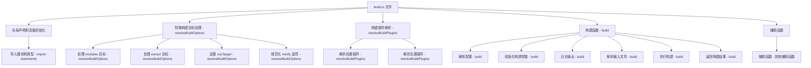

`packages/vite/src/node/build.ts` 文件在 Vite 项目中主要负责处理项目的构建过程。它包含了构建配置的解析、构建插件的加载、以及最终的打包输出等核心功能
### 调用流程图



### 文件结构概览

1. **全局声明和变量初始化**
2. **特殊构建目标处理**
3. **构建插件解析**
4. **构建函数**
5. **辅助函数**

### `build` 函数的具体流程

1. **解析配置**
2. **初始化构建参数**
3. **日志输出**
4. **解析输入文件**
5. **执行构建**
6. **返回构建结果**

### 每个部分的作用

#### 1. 全局声明和变量初始化

```ts
import fs from 'node:fs';
import path from 'node:path';
import colors from 'picocolors';
// 其他导入省略
```

- **导入模块和类型**：导入文件所需的各种模块和类型。

#### 2. 特殊构建目标处理

```ts
if (resolved.target === 'modules') {
  resolved.target = ESBUILD_MODULES_TARGET;
} else if (resolved.target === 'esnext' && resolved.minify === 'terser') {
  // 处理逻辑省略
}

if (!resolved.cssTarget) {
  resolved.cssTarget = resolved.target;
}

if ((resolved.minify as string) === 'false') {
  resolved.minify = false;
} else if (resolved.minify === true) {
  resolved.minify = 'esbuild';
}

if (resolved.cssMinify == null) {
  resolved.cssMinify = !!resolved.minify;
}

return resolved;
```

- **处理 modules 目标**：将 `modules` 目标转换为 `ESBUILD_MODULES_TARGET`。
- **处理 esnext 目标**：根据 `terser` 版本调整目标为 `es2021`。
- **设置 cssTarget**：如果未设置 `cssTarget`，则将其设置为构建目标。
- **规范化 minify 选项**：将 `minify` 选项规范化为布尔值或 `esbuild`。

#### 3. 构建插件解析

```ts
export async function resolveBuildPlugins(config: ResolvedConfig): Promise<{
  pre: Plugin[];
  post: Plugin[];
}> {
  const options = config.build;
  const { commonjsOptions } = options;
  const usePluginCommonjs =
    !Array.isArray(commonjsOptions?.include) ||
    commonjsOptions?.include.length !== 0;
  const rollupOptionsPlugins = options.rollupOptions.plugins;
  return {
    pre: [
      completeSystemWrapPlugin(),
      ...(usePluginCommonjs ? [commonjsPlugin(options.commonjsOptions)] : []),
      dataURIPlugin(),
      ...((await asyncFlatten(arraify(rollupOptionsPlugins))).filter(
        Boolean,
      ) as Plugin[]),
      ...(config.isWorker ? [webWorkerPostPlugin()] : []),
    ],
    post: [
      buildImportAnalysisPlugin(config),
      ...(config.esbuild !== false ? [buildEsbuildPlugin(config)] : []),
      ...(options.minify ? [terserPlugin(config)] : []),
      ...(!config.isWorker
        ? [
            ...(options.manifest ? [manifestPlugin(config)] : []),
            ...(options.ssrManifest ? [ssrManifestPlugin(config)] : []),
            buildReporterPlugin(config),
          ]
        : []),
      loadFallbackPlugin(),
    ],
  };
}
```

- **解析前置插件**：解析并返回构建过程中需要使用的前置插件列表。
- **解析后置插件**：解析并返回构建过程中需要使用的后置插件列表。

#### 4. 构建函数

```ts
export async function build(
  inlineConfig: InlineConfig = {},
): Promise<RollupOutput | RollupOutput[] | RollupWatcher> {
  const config = await resolveConfig(
    inlineConfig,
    'build',
    'production',
    'production',
  );
  const options = config.build;
  const ssr = !!options.ssr;
  const libOptions = options.lib;

  config.logger.info(
    colors.cyan(
      `vite v${VERSION} ${colors.green(
        `building ${ssr ? `SSR bundle ` : ``}for ${config.mode}...`,
      )}`,
    ),
  );

  const resolve = (p: string) => path.resolve(config.root, p);
  const input = libOptions
    ? options.rollupOptions?.input ||
      (typeof libOptions.entry === 'string'
        ? resolve(libOptions.entry)
        : Array.isArray(libOptions.entry)
          ? libOptions.entry.map(resolve)
          : Object.fromEntries(
              Object.entries(libOptions.entry).map(([alias, file]) => [
                alias,
                resolve(file),
              ]),
            ))
    : typeof options.ssr === 'string'
      ? resolve(options.ssr)
      : options.rollupOptions?.input || resolve('index.html');

  // 省略具体的构建逻辑

  return buildResult;
}
```

- **解析配置**：调用 `resolveConfig` 函数解析传入的 `inlineConfig`，并将命令设置为 `build`，模式和环境都设置为 `production`。解析后的配置保存在 `config` 变量中。
- **初始化构建参数**：从解析后的配置中提取构建选项 `options`，并初始化 `ssr` 和 `libOptions` 参数。
- **日志输出**：输出构建开始的日志信息，包括 Vite 版本、构建模式等。
- **解析输入文件**：根据 `libOptions` 和 `ssr` 选项，解析构建的输入文件路径。对于库模式，解析 `libOptions.entry`；对于 SSR 模式，解析 `options.ssr`；否则，默认解析 `index.html`。
- **执行构建**：根据解析后的配置和输入文件，调用 Rollup 或其他构建工具执行实际的构建过程。具体的构建逻辑在这里被省略。
- **返回构建结果**：构建完成后，返回构建结果 `buildResult`。

通过以上的图解和说明，可以更清晰地理解 `packages/vite/src/node/build.ts` 文件的整体流程和 `build` 函数的具体执行步骤。