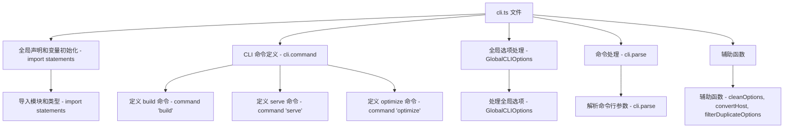

### 文件结构概览

1. **全局声明和变量初始化**
2. **CLI 命令定义**
3. **全局选项处理**
4. **命令处理**
5. **辅助函数**

### 流程图



### 每个部分的作用和对应的函数

#### 1. 全局声明和变量初始化

```ts
import path from 'node:path';
import fs from 'node:fs';
import { performance } from 'node:perf_hooks';
import { cac } from 'cac';
import colors from 'picocolors';
import { VERSION } from './constants';
import type { BuildOptions } from './build';
import type { ServerOptions } from './server';
import type { CLIShortcut } from './shortcuts';
import type { LogLevel } from './logger';
import { createLogger } from './logger';
import { resolveConfig } from './config';
```

- **导入模块和类型 - import statements**：导入文件所需的各种模块和类型。

#### 2. CLI 命令定义 - `cli.command`

```ts
const cli = cac('vite');

cli.command('serve [root]', 'Start a dev server')
  .alias('dev')
  .option('--host [host]', '[string] specify hostname')
  .option('--port <port>', '[number] specify port')
  .option('--https', '[boolean] use https')
  .option('--open', '[boolean] open browser on startup')
  .option('--cors', '[boolean] enable CORS')
  .option('--strictPort', '[boolean] exit if specified port is already in use')
  .option('--force', '[boolean] force the optimizer to ignore the cache and re-bundle')
  .option('--logLevel <level>', '[string] info | warn | error | silent')
  .option('--clearScreen', '[boolean] allow/disable clear screen when logging')
  .option('--config <file>', '[string] use specified config file')
  .option('--mode <mode>', '[string] set env mode')
  .action(async (root: string, options: ServerOptions & GlobalCLIOptions) => {
    // 省略具体逻辑
  });

cli.command('build [root]', 'Build for production')
  .option('--target <target>', '[string] transpile target (default: "modules")')
  .option('--outDir <dir>', '[string] output directory (default: dist)')
  .option('--assetsDir <dir>', '[string] directory under outDir to place assets in (default: assets)')
  .option('--assetsInlineLimit <number>', '[number] static asset base64 inline threshold in bytes (default: 4096)')
  .option('--ssr [entry]', '[string] build specified entry for server-side rendering')
  .option('--sourcemap', '[boolean] output source maps for build (default: false)')
  .option('--minify [minifier]', '[boolean | "terser" | "esbuild"] enable/disable minification, or specify minifier to use (default: "esbuild")')
  .option('--manifest [name]', '[boolean | string] emit build manifest json')
  .option('--ssrManifest [name]', '[boolean | string] emit ssr manifest json')
  .option('--force', '[boolean] force the optimizer to ignore the cache and re-bundle (experimental)')
  .option('--emptyOutDir', '[boolean] force empty outDir when it's outside of root')
  .option('--watch', '[boolean] rebuilds when modules have changed on disk')
  .option('--logLevel <level>', '[string] info | warn | error | silent')
  .option('--clearScreen', '[boolean] allow/disable clear screen when logging')
  .option('--config <file>', '[string] use specified config file')
  .option('--mode <mode>', '[string] set env mode')
  .action(async (root: string, options: BuildOptions & GlobalCLIOptions) => {
    // 省略具体逻辑
  });

cli.command('optimize [root]', 'Pre-bundle dependencies')
  .option('--force', '[boolean] force the optimizer to ignore the cache and re-bundle')
  .action(async (root: string, options: GlobalCLIOptions) => {
    // 省略具体逻辑
  });
```

- **定义 serve 命令 - cli.command('serve')**：定义启动开发服务器的命令及其选项。
- **定义 build 命令 - cli.command('build')**：定义生产环境构建的命令及其选项。
- **定义 optimize 命令 - cli.command('optimize')**：定义预打包依赖的命令及其选项。

#### 3. 全局选项处理 - `GlobalCLIOptions`

```ts
interface GlobalCLIOptions {
  '--'?: string[];
  c?: boolean | string;
  config?: string;
  base?: string;
  l?: LogLevel;
  logLevel?: LogLevel;
  clearScreen?: boolean;
  d?: boolean | string;
  debug?: boolean | string;
  f?: string;
  filter?: string;
  m?: string;
  mode?: string;
  force?: boolean;
}
```

- **处理全局选项 - GlobalCLIOptions**：定义全局选项的接口，用于处理命令行中的全局参数。

#### 4. 命令处理 - `cli.parse`

```ts
cli.help();
cli.version(VERSION);

cli.parse();
```

- **解析命令行参数 - cli.parse**：解析命令行参数并执行相应的命令。

#### 5. 辅助函数

```ts
function cleanOptions<Options extends GlobalCLIOptions>(
  options: Options,
): Omit<Options, keyof GlobalCLIOptions> {
  const ret = { ...options };
  delete ret['--'];
  delete ret.c;
  delete ret.config;
  delete ret.base;
  delete ret.l;
  delete ret.logLevel;
  delete ret.clearScreen;
  delete ret.d;
  delete ret.debug;
  delete ret.f;
  delete ret.filter;
  delete ret.m;
  delete ret.mode;

  // convert the sourcemap option to a boolean if necessary
  if ('sourcemap' in ret) {
    const sourcemap = ret.sourcemap as `${boolean}` | 'inline' | 'hidden';
    ret.sourcemap =
      sourcemap === 'true'
        ? true
        : sourcemap === 'false'
          ? false
          : ret.sourcemap;
  }

  return ret;
}

const filterDuplicateOptions = <T extends object>(options: T) => {
  for (const [key, value] of Object.entries(options)) {
    if (Array.isArray(value)) {
      options[key as keyof T] = value[value.length - 1];
    }
  }
};

const convertHost = (v: any) => {
  if (typeof v === 'number') {
    return String(v);
  }
  return v;
};
```

- **辅助函数 - cleanOptions, convertHost, filterDuplicateOptions**：定义了一些辅助函数，用于清理和处理命令行选项。