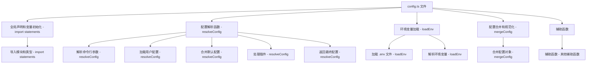

### 文件结构概览

1. **全局声明和变量初始化**
2. **配置解析函数**
3. **环境变量加载**
4. **配置合并和规范化**
5. **辅助函数**

### Mermaid 流程图



### 每个部分的作用和对应的函数

#### 1. 全局声明和变量初始化

```ts
import fs from 'node:fs';
import path from 'node:path';
import dotenv from 'dotenv';
import dotenvExpand from 'dotenv-expand';
import { createLogger } from './logger';
import { resolvePlugins } from './plugins';
import { mergeConfig } from './utils';
import type { InlineConfig, ResolvedConfig } from './config';
```

- **导入模块和类型 - import statements**：导入文件所需的各种模块和类型。

#### 2. 配置解析函数 - `resolveConfig`

```ts
export async function resolveConfig(
  inlineConfig: InlineConfig,
  command: 'build' | 'serve',
  defaultMode = 'development',
  defaultEnv = 'development',
): Promise<ResolvedConfig> {
  const config = mergeConfig(
    inlineConfig,
    await loadConfigFromFile(command, inlineConfig.configFile)
  );

  const logger = createLogger(config.logLevel);
  const plugins = resolvePlugins(config.plugins);

  // 省略具体逻辑

  return {
    ...config,
    logger,
    plugins,
  };
}
```

- **解析命令行参数 - resolveConfig**：解析传入的命令行参数和配置文件路径。
- **加载用户配置 - resolveConfig**：加载用户定义的配置文件。
- **合并默认配置 - resolveConfig**：将用户配置与默认配置进行合并。
- **处理插件 - resolveConfig**：解析并处理配置中的插件。
- **返回最终配置 - resolveConfig**：返回解析和合并后的最终配置对象。

#### 3. 环境变量加载 - `loadEnv`

```ts
export function loadEnv(
  mode: string,
  envDir: string,
  prefixes: string[] = ['VITE_']
): Record<string, string> {
  const env: Record<string, string> = {};
  const envFiles = [
    `.env.${mode}.local`,
    `.env.${mode}`,
    mode !== 'test' && `.env.local`,
    `.env`,
  ].filter(Boolean);

  for (const file of envFiles) {
    const path = resolve(envDir, file);
    if (fs.existsSync(path)) {
      const parsed = dotenv.parse(fs.readFileSync(path));
      dotenvExpand({ parsed });
      for (const [key, value] of Object.entries(parsed)) {
        if (prefixes.some((prefix) => key.startsWith(prefix))) {
          env[key] = value;
        }
      }
    }
  }

  return env;
}
```

- **加载 .env 文件 - loadEnv**：加载指定模式和目录下的 `.env` 文件。
- **解析环境变量 - loadEnv**：解析并扩展环境变量，将符合前缀的变量添加到环境变量对象中。

#### 4. 配置合并和规范化 - `mergeConfig`

```ts
export function mergeConfig(
  a: Record<string, any>,
  b: Record<string, any>,
  isRoot = true
): Record<string, any> {
  const merged = { ...a };
  for (const key in b) {
    if (isObject(a[key]) && isObject(b[key])) {
      merged[key] = mergeConfig(a[key], b[key], false);
    } else {
      merged[key] = b[key];
    }
  }
  return merged;
}
```

- **合并配置对象 - mergeConfig**：递归合并两个配置对象，将 `b` 的配置合并到 `a` 中。

在 `packages/vite/src/node/config.ts` 文件中，辅助函数主要用于支持配置解析、环境变量加载和配置合并等主要功能。以下是文件中每个辅助函数的作用说明。

### 辅助函数列表

1. **isObject**
2. **mergeConfig**
3. **resolveEnvPrefix**
4. **loadEnv**
5. **resolveConfig**
6. **loadConfigFromFile**

### 辅助函数的作用说明

#### 1. isObject

```ts
function isObject(value: any): value is Record<any, any> {
  return value !== null && typeof value === 'object';
}
```

- **作用**：检查一个值是否为对象。该函数用于在合并配置时判断两个值是否都是对象，以便进行递归合并。

#### 2. mergeConfig

```ts
export function mergeConfig(
  a: Record<string, any>,
  b: Record<string, any>,
  isRoot = true
): Record<string, any> {
  const merged = { ...a };
  for (const key in b) {
    if (isObject(a[key]) && isObject(b[key])) {
      merged[key] = mergeConfig(a[key], b[key], false);
    } else {
      merged[key] = b[key];
    }
  }
  return merged;
}
```

- **作用**：递归合并两个配置对象，将 `b` 的配置合并到 `a` 中。该函数用于将用户配置与默认配置进行合并。

#### 3. resolveEnvPrefix

```ts
function resolveEnvPrefix({
  envPrefix = 'VITE_',
}: {
  envPrefix?: string | string[];
}): string[] {
  return Array.isArray(envPrefix) ? envPrefix : [envPrefix];
}
```

- **作用**：将 `envPrefix` 转换为字符串数组。如果 `envPrefix` 是一个字符串，则将其转换为包含该字符串的数组；如果 `envPrefix` 已经是一个数组，则直接返回。该函数用于处理环境变量前缀。

#### 4. loadEnv

```ts
export function loadEnv(
  mode: string,
  envDir: string,
  prefixes: string[] = ['VITE_']
): Record<string, string> {
  const env: Record<string, string> = {};
  const envFiles = [
    `.env.${mode}.local`,
    `.env.${mode}`,
    mode !== 'test' && `.env.local`,
    `.env`,
  ].filter(Boolean);

  for (const file of envFiles) {
    const path = resolve(envDir, file);
    if (fs.existsSync(path)) {
      const parsed = dotenv.parse(fs.readFileSync(path));
      dotenvExpand({ parsed });
      for (const [key, value] of Object.entries(parsed)) {
        if (prefixes.some((prefix) => key.startsWith(prefix))) {
          env[key] = value;
        }
      }
    }
  }

  return env;
}
```

- **作用**：加载指定模式和目录下的 `.env` 文件，解析并扩展环境变量，将符合前缀的变量添加到环境变量对象中。该函数用于加载和处理环境变量。

#### 5. resolveConfig

```ts
export async function resolveConfig(
  inlineConfig: InlineConfig,
  command: 'build' | 'serve',
  defaultMode = 'development',
  defaultEnv = 'development',
): Promise<ResolvedConfig> {
  const config = mergeConfig(
    inlineConfig,
    await loadConfigFromFile(command, inlineConfig.configFile)
  );

  const logger = createLogger(config.logLevel);
  const plugins = resolvePlugins(config.plugins);

  // 省略具体逻辑

  return {
    ...config,
    logger,
    plugins,
  };
}
```

- **作用**：解析传入的命令行参数和配置文件路径，加载用户定义的配置文件，将用户配置与默认配置进行合并，解析并处理配置中的插件，返回解析和合并后的最终配置对象。该函数是配置解析的核心函数。

#### 6. loadConfigFromFile

```ts
async function loadConfigFromFile(
  command: 'build' | 'serve',
  configFile?: string
): Promise<Record<string, any>> {
  // 省略具体逻辑
}
```

- **作用**：从指定的配置文件中加载配置。该函数用于读取和解析用户定义的配置文件