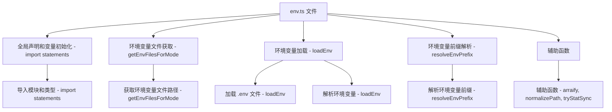

### 文件结构概览

1. **全局声明和变量初始化**
2. **环境变量文件获取**
3. **环境变量加载**
4. **环境变量前缀解析**
5. **辅助函数**

### 流程图



### 每个部分的作用和对应的函数

#### 1. 全局声明和变量初始化

```ts
import fs from 'node:fs';
import path from 'node:path';
import { parse } from 'dotenv';
import { type DotenvPopulateInput, expand } from 'dotenv-expand';
import { arraify, normalizePath, tryStatSync } from './utils';
import type { UserConfig } from './config';
```

- **导入模块和类型 - import statements**：导入文件所需的各种模块和类型。

#### 2. 环境变量文件获取 - `getEnvFilesForMode`

```ts
export function getEnvFilesForMode(mode: string, envDir: string): string[] {
  return [
    `.env`,
    `.env.local`,
    `.env.${mode}`,
    `.env.${mode}.local`,
  ].map((file) => normalizePath(path.join(envDir, file)));
}
```

- **获取环境变量文件路径 - getEnvFilesForMode**：根据模式和环境目录，返回可能存在的环境变量文件路径列表。

#### 3. 环境变量加载 - `loadEnv`

```ts
export function loadEnv(
  mode: string,
  envDir: string,
  prefixes: string | string[] = 'VITE_',
): Record<string, string> {
  if (mode === 'local') {
    throw new Error(
      `"local" cannot be used as a mode name because it conflicts with ` +
        `the .local postfix for .env files.`,
    );
  }
  prefixes = arraify(prefixes);
  const env: Record<string, string> = {};
  const envFiles = getEnvFilesForMode(mode, envDir);

  const parsed = Object.fromEntries(
    envFiles.flatMap((filePath) => {
      if (!tryStatSync(filePath)?.isFile()) return [];

      return Object.entries(parse(fs.readFileSync(filePath)));
    }),
  );

  if (parsed.NODE_ENV && process.env.VITE_USER_NODE_ENV === undefined) {
    process.env.VITE_USER_NODE_ENV = parsed.NODE_ENV;
  }
  if (parsed.BROWSER && process.env.BROWSER === undefined) {
    process.env.BROWSER = parsed.BROWSER;
  }
  if (parsed.BROWSER_ARGS && process.env.BROWSER_ARGS === undefined) {
    process.env.BROWSER_ARGS = parsed.BROWSER_ARGS;
  }

  const processEnv = { ...process.env } as DotenvPopulateInput;
  expand({ parsed, processEnv });

  for (const [key, value] of Object.entries(parsed)) {
    if (prefixes.some((prefix) => key.startsWith(prefix))) {
      env[key] = value;
    }
  }

  for (const key in process.env) {
    if (prefixes.some((prefix) => key.startsWith(prefix))) {
      env[key] = process.env[key] as string;
    }
  }

  return env;
}
```

- **加载 .env 文件 - loadEnv**：加载指定模式和目录下的 `.env` 文件。
- **解析环境变量 - loadEnv**：解析并扩展环境变量，将符合前缀的变量添加到环境变量对象中。

#### 4. 环境变量前缀解析 - `resolveEnvPrefix`

```ts
export function resolveEnvPrefix({
  envPrefix = 'VITE_',
}: UserConfig): string[] {
  envPrefix = arraify(envPrefix);
  if (envPrefix.includes('')) {
    throw new Error(
      `envPrefix option contains value '', which could lead unexpected exposure of sensitive information.`,
    );
  }
  return envPrefix;
}
```

- **解析环境变量前缀 - resolveEnvPrefix**：将 `envPrefix` 转换为字符串数组，并检查是否包含空字符串。

#### 5. 辅助函数

```ts
// 其他辅助函数省略
```

- **辅助函数 - arraify, normalizePath, tryStatSync**：文件中可能包含其他辅助函数，用于支持主要功能的实现。

### 辅助函数的作用说明

#### 1. arraify

```ts
export function arraify<T>(target: T | T[]): T[] {
  return Array.isArray(target) ? target : [target];
}
```

- **作用**：将传入的参数转换为数组。如果参数已经是数组，则直接返回；否则，将参数包装成数组。

#### 2. normalizePath

```ts
export function normalizePath(id: string): string {
  return path.posix.normalize(id.replace(/\\/g, '/'));
}
```

- **作用**：规范化路径，将 Windows 路径中的反斜杠替换为正斜杠，并使用 POSIX 规范化路径。

#### 3. tryStatSync

```ts
export function tryStatSync(file: string): fs.Stats | undefined {
  try {
    return fs.statSync(file);
  } catch {
    return undefined;
  }
}
```

- **作用**：尝试同步获取文件状态。如果文件存在，则返回文件状态对象；否则，返回 `undefined`。