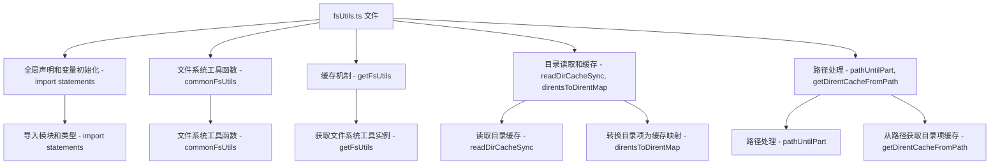

### 文件结构概览

1. **全局声明和变量初始化**
2. **文件系统工具函数**
3. **缓存机制**
4. **目录读取和缓存**
5. **路径处理**

### Mermaid 流程图



### 每个部分的作用和对应的函数

#### 1. 全局声明和变量初始化

```ts
import fs from 'node:fs';
import path from 'node:path';
import type { FSWatcher } from 'dep-types/chokidar';
import type { ResolvedConfig } from './config';
import {
  isInNodeModules,
  normalizePath,
  safeRealpathSync,
  tryStatSync,
} from './utils';
```

- **导入模块和类型 - import statements**：导入文件所需的各种模块和类型。

#### 2. 文件系统工具函数 - `commonFsUtils`

```ts
export const commonFsUtils: FsUtils = {
  existsSync: fs.existsSync,
  isDirectory,
  tryResolveRealFile,
  tryResolveRealFileWithExtensions,
  tryResolveRealFileOrType,
};
```

- **文件系统工具函数 - commonFsUtils**：定义了一组常用的文件系统工具函数，如 `existsSync`、`isDirectory`、`tryResolveRealFile` 等。

#### 3. 缓存机制 - `getFsUtils`

```ts
const cachedFsUtilsMap = new WeakMap<ResolvedConfig, FsUtils>();

export function getFsUtils(config: ResolvedConfig): FsUtils {
  let fsUtils = cachedFsUtilsMap.get(config);
  if (!fsUtils) {
    if (
      config.command !== 'serve' ||
      config.server.fs.cachedChecks === false ||
      config.server.watch?.ignored ||
      process.versions.pnp
    ) {
      fsUtils = commonFsUtils;
    } else if (
      !config.resolve.preserveSymlinks &&
      config.root !== getRealPath(config.root)
    ) {
      fsUtils = commonFsUtils;
    } else {
      fsUtils = createCachedFsUtils(config);
    }
    cachedFsUtilsMap.set(config, fsUtils);
  }
  return fsUtils;
}
```

- **获取文件系统工具实例 - getFsUtils**：根据配置获取文件系统工具实例，支持缓存机制，以提高性能。

#### 4. 目录读取和缓存 - `readDirCacheSync`, `direntsToDirentMap`

```ts
function readDirCacheSync(file: string): undefined | DirentsMap {
  let dirents: fs.Dirent[];
  try {
    dirents = fs.readdirSync(file, { withFileTypes: true });
  } catch {
    return;
  }
  return direntsToDirentMap(dirents);
}

function direntsToDirentMap(fsDirents: fs.Dirent[]): DirentsMap {
  const dirents: DirentsMap = new Map();
  for (const dirent of fsDirents) {
    const type = dirent.isDirectory()
      ? 'directory'
      : dirent.isSymbolicLink()
      ? 'symlink'
      : dirent.isFile()
      ? 'file'
      : undefined;
    if (type) {
      dirents.set(dirent.name, { type });
    }
  }
  return dirents;
}
```

- **读取目录缓存 - readDirCacheSync**：同步读取目录内容，并将其转换为缓存映射。
- **转换目录项为缓存映射 - direntsToDirentMap**：将目录项转换为缓存映射，以便后续快速访问。

#### 5. 路径处理 - `pathUntilPart`, `getDirentCacheFromPath`

```ts
function pathUntilPart(root: string, parts: string[], i: number): string {
  let p = root;
  for (let k = 0; k < i; k++) p += '/' + parts[k];
  return p;
}

function getDirentCacheFromPath(
  normalizedFile: string,
): DirentCache | false | undefined {
  if (normalizedFile[normalizedFile.length - 1] === '/') {
    normalizedFile = normalizedFile.slice(0, -1);
  }
  if (normalizedFile === root) {
    return rootCache;
  }
  if (!normalizedFile.startsWith(rootDirPath)) {
    return undefined;
  }
  const pathFromRoot = normalizedFile.slice(rootDirPath.length);
  const parts = pathFromRoot.split('/');
  const direntCache = getDirentCacheSync(parts);
  if (!direntCache || direntCache.type === 'error') {
    return false;
  }
  return direntCache;
}
```

- **路径处理 - pathUntilPart**：根据路径部分构建完整路径。
- **从路径获取目录项缓存 - getDirentCacheFromPath**：从路径获取目录项缓存，以便快速访问目录内容。

通过以上的流程图和详细说明，可以更清晰地理解 `packages/vite/src/node/fsUtils.ts` 文件的整体流程和每个函数的具体作用。