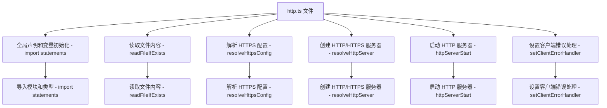

为了更好地理解 `packages/vite/src/node/http.ts` 文件的整体流程，并明确每个函数的意义，我们可以使用 Mermaid 来绘制一个详细的流程图，并用中文标注每个步骤。以下是详细的流程图和每个函数的说明。

### 文件结构概览

1. **全局声明和变量初始化**
2. **读取文件内容**
3. **解析 HTTPS 配置**
4. **创建 HTTP/HTTPS 服务器**
5. **启动 HTTP 服务器**
6. **设置客户端错误处理**

### Mermaid 流程图



### 每个部分的作用和对应的函数

#### 1. 全局声明和变量初始化

```ts
import fsp from 'node:fs/promises';
import path from 'node:path';
import type { OutgoingHttpHeaders as HttpServerHeaders } from 'node:http';
import type { ServerOptions as HttpsServerOptions } from 'node:https';
import type { Connect } from 'dep-types/connect';
import colors from 'picocolors';
import type { ProxyOptions } from './server/middlewares/proxy';
import type { Logger } from './logger';
import type { HttpServer } from './server';
```

- **导入模块和类型 - import statements**：导入文件所需的各种模块和类型，包括 Node.js 内置模块、Vite 内部工具函数和类型等。

#### 2. 读取文件内容 - `readFileIfExists`

```ts
async function readFileIfExists(value?: string | Buffer | any[]) {
  if (typeof value === 'string') {
    return fsp.readFile(path.resolve(value)).catch(() => value);
  }
  return value;
}
```

- **读取文件内容 - readFileIfExists**：尝试读取文件内容，如果文件存在则返回文件内容，否则返回原始值。该函数用于读取 HTTPS 配置中的证书文件。

#### 3. 解析 HTTPS 配置 - `resolveHttpsConfig`

```ts
export async function resolveHttpsConfig(
  https: HttpsServerOptions | undefined,
): Promise<HttpsServerOptions | undefined> {
  if (!https) return undefined;

  const [ca, cert, key, pfx] = await Promise.all([
    readFileIfExists(https.ca),
    readFileIfExists(https.cert),
    readFileIfExists(https.key),
    readFileIfExists(https.pfx),
  ]);
  return { ...https, ca, cert, key, pfx };
}
```

- **解析 HTTPS 配置 - resolveHttpsConfig**：解析 HTTPS 配置，读取证书文件内容，并返回包含证书内容的 HTTPS 配置对象。

#### 4. 创建 HTTP/HTTPS 服务器 - `resolveHttpServer`

```ts
export async function resolveHttpServer(
  { proxy }: CommonServerOptions,
  app: Connect.Server,
  httpsOptions?: HttpsServerOptions,
): Promise<HttpServer> {
  if (!httpsOptions) {
    const { createServer } = await import('node:http');
    return createServer(app);
  }

  if (proxy) {
    const { createServer } = await import('node:https');
    return createServer(httpsOptions, app);
  } else {
    const { createSecureServer } = await import('node:http2');
    return createSecureServer(
      {
        maxSessionMemory: 1000,
        ...httpsOptions,
        allowHTTP1: true,
      },
      app,
    );
  }
}
```

- **创建 HTTP/HTTPS 服务器 - resolveHttpServer**：根据配置创建 HTTP 或 HTTPS 服务器。如果配置了 HTTPS，则创建 HTTPS 服务器；如果配置了代理，则创建支持代理的 HTTPS 服务器；否则，创建 HTTP/2 服务器。

#### 5. 启动 HTTP 服务器 - `httpServerStart`

```ts
export async function httpServerStart(
  httpServer: HttpServer,
  serverOptions: {
    port: number;
    strictPort: boolean | undefined;
    host: string | undefined;
    logger: Logger;
  },
): Promise<number> {
  let { port, strictPort, host, logger } = serverOptions;

  return new Promise((resolve, reject) => {
    const onError = (e: Error & { code?: string }) => {
      if (e.code === 'EADDRINUSE') {
        if (strictPort) {
          httpServer.removeListener('error', onError);
          reject(new Error(`Port ${port} is already in use`));
        } else {
          logger.info(`Port ${port} is in use, trying another one...`);
          httpServer.listen(++port, host);
        }
      } else {
        httpServer.removeListener('error', onError);
        reject(e);
      }
    };

    httpServer.on('error', onError);

    httpServer.listen(port, host, () => {
      httpServer.removeListener('error', onError);
      resolve(port);
    });
  });
}
```

- **启动 HTTP 服务器 - httpServerStart**：启动 HTTP 服务器，并处理端口占用错误。如果指定的端口被占用且 `strictPort` 为 `false`，则尝试使用下一个端口。

#### 6. 设置客户端错误处理 - `setClientErrorHandler`

```ts
export function setClientErrorHandler(
  server: HttpServer,
  logger: Logger,
): void {
  server.on('clientError', (err, socket) => {
    let msg = '400 Bad Request';
    if ((err as any).code === 'HPE_HEADER_OVERFLOW') {
      msg = '431 Request Header Fields Too Large';
      logger.warn(
        colors.yellow(
          'Server responded with status code 431. ' +
            'See https://vitejs.dev/guide/troubleshooting.html#_431-request-header-fields-too-large.',
        ),
      );
    }
    if ((err as any).code === 'ECONNRESET' || !socket.writable) {
      return;
    }
    socket.end(`HTTP/1.1 ${msg}\r\n\r\n`);
  });
}
```

- **设置客户端错误处理 - setClientErrorHandler**：设置 HTTP 服务器的客户端错误处理逻辑，处理常见的客户端错误并返回适当的 HTTP 状态码。

### 总结

`packages/vite/src/node/http.ts` 文件在 Vite 项目中主要负责处理 HTTP 和 HTTPS 服务器的创建和启动。它通过读取文件内容、解析 HTTPS 配置、创建 HTTP/HTTPS 服务器、启动服务器以及设置客户端错误处理，实现了 Vite 项目对 HTTP 和 HTTPS 的支持。该文件的核心功能包括读取文件内容、解析 HTTPS 配置、创建 HTTP/HTTPS 服务器、启动 HTTP 服务器以及设置客户端错误处理等。通过以上的流程图和详细说明，可以更清晰地理解 `packages/vite/src/node/http.ts` 文件的整体流程和每个函数的具体作用。