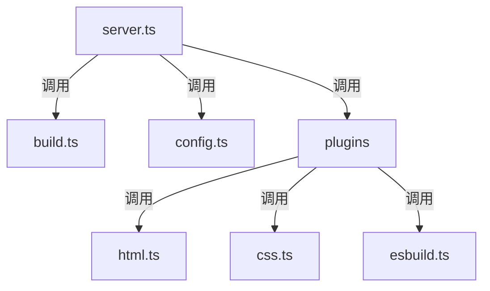

### 目录结构
```plaintext
vitejs/vite
├── src
│   ├── node
│   │   ├── server.ts
│   │   ├── build.ts
│   │   ├── config.ts
│   │   ├── plugins
│   │   │   ├── html.ts
│   │   │   ├── css.ts
│   │   │   ├── esbuild.ts
│   │   │   └── ...
│   │   └── ...
│   └── ...
```

### 文件调用图解



### 作用说明

1. **server.ts**:
   - 作用：服务器端入口文件，负责启动开发服务器。
   - 主要功能：
     - 初始化和配置开发服务器。
     - 处理文件请求和热模块替换（HMR）。
     - 调用 `config.ts` 来加载和解析配置。
     - 调用 `build.ts` 来处理构建逻辑。
     - 调用 `plugins` 目录下的插件来处理不同类型的资源。

2. **build.ts**:
   - 作用：处理构建逻辑。
   - 主要功能：
     - 使用 Rollup 进行代码打包。
     - 处理构建过程中涉及的各种插件和配置。
     - 输出优化后的静态资源。

3. **config.ts**:
   - 作用：加载和解析 Vite 配置文件。
   - 主要功能：
     - 读取用户提供的配置文件。
     - 合并默认配置和用户配置。
     - 提供配置验证和转换功能。

4. **plugins**:
   - 作用：包含各种插件，用于处理不同类型的资源。
   - 主要插件：
     - **html.ts**: 处理 HTML 文件，支持模板注入和资源链接的处理。
     - **css.ts**: 处理 CSS 文件，支持预处理器和模块化 CSS。
     - **esbuild.ts**: 使用 esbuild 进行快速的 JavaScript 和 TypeScript 转换。

### 调用关系说明

- `server.ts` 是服务器端的主要入口文件，负责启动和配置开发服务器。
- `server.ts` 会调用 `config.ts` 来加载和解析配置文件。
- `server.ts` 会调用 `build.ts` 来处理构建逻辑。
- `server.ts` 会调用 `plugins` 目录下的插件（如 `html.ts`、`css.ts`、`esbuild.ts`）来处理不同类型的资源。
- `plugins` 目录下的插件各自负责处理特定类型的文件，并在构建过程中被调用。