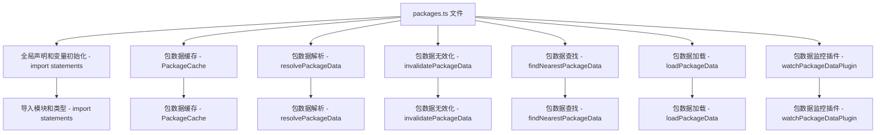

### 文件结构概览

1. **全局声明和变量初始化**
2. **包数据缓存**
3. **包数据解析**
4. **包数据无效化**
5. **包数据查找**
6. **包数据加载**
7. **包数据监控插件**

### Mermaid 流程图



### 每个部分的作用和对应的函数

#### 1. 全局声明和变量初始化

```ts
import fs from 'node:fs';
import path from 'node:path';
import { createRequire } from 'node:module';
import {
  createFilter,
  isInNodeModules,
  normalizePath,
  safeRealpathSync,
  tryStatSync,
} from './utils';
import type { Plugin } from './plugin';

let pnp: typeof import('pnpapi') | undefined;
if (process.versions.pnp) {
  try {
    pnp = createRequire(import.meta.url)('pnpapi');
  } catch {}
}
```

- **导入模块和类型 - import statements**：导入文件所需的各种模块和类型，包括 Node.js 内置模块、Vite 内部工具函数和类型等。

#### 2. 包数据缓存 - `PackageCache`

```ts
/** Cache for package.json resolution and package.json contents */
export type PackageCache = Map<string, PackageData>;

export interface PackageData {
  dir: string;
  hasSideEffects: (id: string) => boolean | 'no-treeshake' | null;
  webResolvedImports: Record<string, string | undefined>;
  nodeResolvedImports: Record<string, string | undefined>;
  setResolvedCache: (key: string, entry: string, targetWeb: boolean) => void;
  getResolvedCache: (key: string, targetWeb: boolean) => string | undefined;
  data: {
    [field: string]: any;
    name: string;
    type: string;
    version: string;
    main: string;
    module: string;
    browser: string | Record<string, string | false>;
    exports: string | Record<string, any> | string[];
    imports: Record<string, any>;
    dependencies: Record<string, string>;
  };
}
```

- **包数据缓存 - PackageCache**：定义了包数据缓存的类型和结构，用于缓存 `package.json` 的解析结果和内容。

#### 3. 包数据解析 - `resolvePackageData`

```ts
export function resolvePackageData(
  pkgName: string,
  basedir: string,
  preserveSymlinks = false,
  packageCache?: PackageCache,
): PackageData | null {
  if (pnp) {
    const cacheKey = getRpdCacheKey(pkgName, basedir, preserveSymlinks);
    if (packageCache?.has(cacheKey)) return packageCache.get(cacheKey)!;

    try {
      const pkg = pnp.resolveToUnqualified(pkgName, basedir, {
        considerBuiltins: false,
      });
      if (!pkg) return null;

      const pkgData = loadPackageData(path.join(pkg, 'package.json'));
      packageCache?.set(cacheKey, pkgData);
      return pkgData;
    } catch {
      return null;
    }
  }

  const originalBasedir = basedir;
  while (basedir) {
    if (packageCache) {
      const cached = getRpdCache(
        packageCache,
        pkgName,
        basedir,
        originalBasedir,
        preserveSymlinks,
      );
      if (cached) return cached;
    }

    const pkg = path.join(basedir, 'node_modules', pkgName, 'package.json');
    try {
      if (fs.existsSync(pkg)) {
        const pkgPath = preserveSymlinks ? pkg : safeRealpathSync(pkg);
        const pkgData = loadPackageData(pkgPath);

        if (packageCache) {
          setRpdCache(
            packageCache,
            pkgData,
            pkgName,
            basedir,
            originalBasedir,
            preserveSymlinks,
          );
        }

        return pkgData;
      }
    } catch {}

    const nextBasedir = path.dirname(basedir);
    if (nextBasedir === basedir) break;
    basedir = nextBasedir;
  }

  return null;
}
```

- **包数据解析 - resolvePackageData**：解析包数据，尝试从缓存中获取包数据，如果缓存中不存在，则从文件系统中读取 `package.json` 文件并解析其内容。

#### 4. 包数据无效化 - `invalidatePackageData`

```ts
function invalidatePackageData(
  packageCache: PackageCache,
  pkgPath: string,
): void {
  const pkgDir = normalizePath(path.dirname(pkgPath));
  packageCache.forEach((pkg, cacheKey) => {
    if (pkg.dir === pkgDir) {
      packageCache.delete(cacheKey);
    }
  });
}
```

- **包数据无效化 - invalidatePackageData**：无效化包数据缓存，当 `package.json` 文件发生变化时，从缓存中删除对应的包数据。

#### 5. 包数据查找 - `findNearestPackageData`

```ts
export function findNearestPackageData(
  basedir: string,
  packageCache?: PackageCache,
): PackageData | null {
  const originalBasedir = basedir;
  while (basedir) {
    if (packageCache) {
      const cached = getFnpdCache(packageCache, basedir, originalBasedir);
      if (cached) return cached;
    }

    const pkgPath = path.join(basedir, 'package.json');
    if (tryStatSync(pkgPath)?.isFile()) {
      try {
        const pkgData = loadPackageData(pkgPath);

        if (packageCache) {
          setFnpdCache(packageCache, pkgData, basedir, originalBasedir);
        }

        return pkgData;
      } catch {}
    }

    const nextBasedir = path.dirname(basedir);
    if (nextBasedir === basedir) break;
    basedir = nextBasedir;
  }

  return null;
}
```

- **包数据查找 - findNearestPackageData**：查找最近的 `package.json` 文件并解析其内容，返回包数据。

#### 6. 包数据加载 - `loadPackageData`

```ts
export function loadPackageData(pkgPath: string): PackageData {
  const data = JSON.parse(fs.readFileSync(pkgPath, 'utf-8'));
  const pkgDir = normalizePath(path.dirname(pkgPath));
  const { sideEffects } = data;
  let hasSideEffects: (id: string) => boolean | null;
  if (typeof sideEffects === 'boolean') {
    hasSideEffects = () => sideEffects;
  } else if (Array.isArray(sideEffects)) {
    if (sideEffects.length <= 0) {
      hasSideEffects = () => false;
    } else {
      const finalPackageSideEffects = sideEffects.map((sideEffect) => {
        if (sideEffect.includes('/')) {
          return sideEffect;
        }
        return `**/${sideEffect}`;
      });

      hasSideEffects = createFilter(finalPackageSideEffects, null, {
        resolve: pkgDir,
      });
    }
  } else {
    hasSideEffects = () => null;
  }

  const pkg: PackageData = {
    dir: pkgDir,
    data,
    hasSideEffects,
    webResolvedImports: {},
    nodeResolvedImports: {},
    setResolvedCache(key: string, entry: string, targetWeb: boolean) {
      if (targetWeb) {
        pkg.webResolvedImports[key] = entry;
      } else {
        pkg.nodeResolvedImports[key] = entry;
      }
    },
    getResolvedCache(key: string, targetWeb: boolean) {
      if (targetWeb) {
        return pkg.webResolvedImports[key];
      } else {
        return pkg.nodeResolvedImports[key];
      }
    },
  };

  return pkg;
}
```

- **包数据加载 - loadPackageData**：从 `package.json` 文件中加载包数据，并处理 `sideEffects` 字段，返回包数据对象。

#### 7. 包数据监控插件 - `watchPackageDataPlugin`

```ts
export function watchPackageDataPlugin(packageCache: PackageCache): Plugin {
  const watchQueue = new Set<string>();
  const watchedDirs = new Set<string>();

  const watchFileStub = (id: string) => {
    watchQueue.add(id);
  };
  let watchFile = watchFileStub;

  const setPackageData = packageCache.set.bind(packageCache);
  packageCache.set = (id, pkg) => {
    if (!isInNodeModules(pkg.dir) && !watchedDirs.has(pkg.dir)) {
      watchedDirs.add(pkg.dir);
      watchFile(path.join(pkg.dir, 'package.json'));
    }
    return setPackageData(id, pkg);
  };

  return {
    name: 'vite:watch-package-data',
    buildStart() {
      watchFile = this.addWatchFile.bind(this);
      watchQueue.forEach(watchFile);
      watchQueue.clear();
    },
    buildEnd() {
      watchFile = watchFileStub;
    },
    watchChange(id) {
      if (id.endsWith('/package.json')) {
        invalidatePackageData(packageCache, path.normalize(id));
      }
    },
    handleHotUpdate({ file }) {
      if (file.endsWith('/package.json')) {
        invalidatePackageData(packageCache, path.normalize(file));
      }
    },
  };
}
```

- **包数据监控插件 - watchPackageDataPlugin**：创建一个插件，用于监控 `package.json` 文件的变化，并在文件变化时无效化包数据缓存。