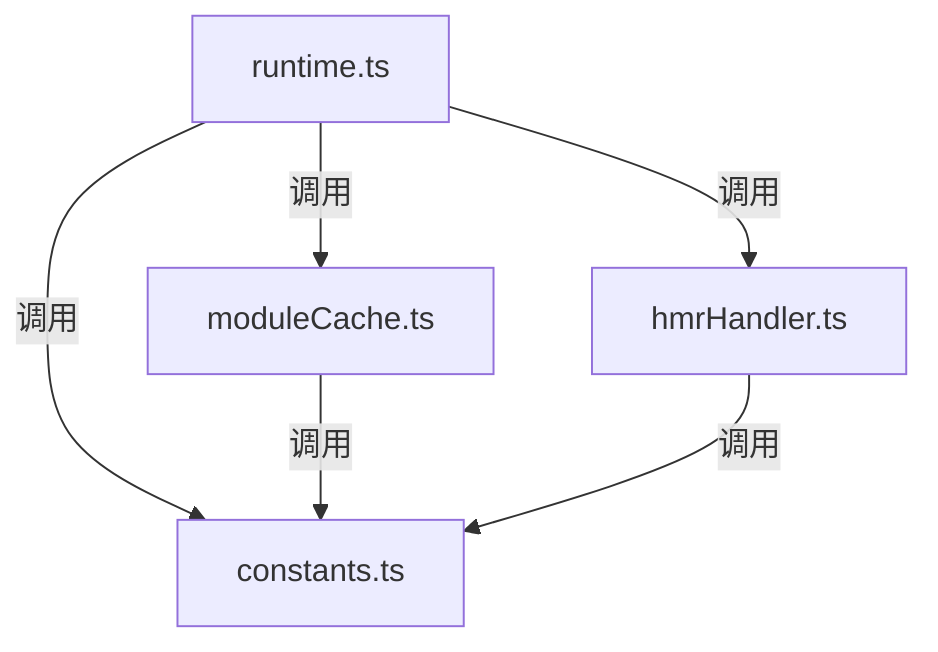

好的，以下是 `vitejs/vite` 仓库中 `src/runtime` 目录的作用及其调用关系的图解。

### 目录结构

```plaintext
vitejs/vite
├── src
│   ├── runtime
│   │   ├── moduleCache.ts
│   │   ├── constants.ts
│   │   ├── hmrHandler.ts
│   │   ├── runtime.ts
│   │   └── ...
│   └── ...
```

### 文件调用顺序图解



### 作用说明

1. **runtime.ts**:
   - 作用：定义 `ViteRuntime` 类，提供运行时 API，用于在客户端和服务器之间进行通信和代码执行。
   - 主要功能：
     - 提供 `executeUrl` 和 `executeEntrypoint` 方法，用于执行指定的 URL 或入口点。
     - 提供缓存清理和销毁方法。
     - 管理模块缓存和 HMR 监听器。

2. **moduleCache.ts**:
   - 作用：管理模块缓存。
   - 主要功能：
     - 定义 `ModuleCacheMap` 类，用于存储和管理模块缓存。
     - 提供缓存更新、删除和无效化的方法。
     - 支持依赖树的无效化处理。

3. **constants.ts**:
   - 作用：定义运行时使用的常量。
   - 主要功能：
     - 定义 SSR 相关的常量，如 `ssrModuleExportsKey`、`ssrImportKey` 等。

4. **hmrHandler.ts**:
   - 作用：处理热模块替换（HMR）逻辑。
   - 主要功能：
     - 定义 `createHMRHandler` 函数，用于创建 HMR 处理器。
     - 处理不同类型的 HMR 消息，如更新、全量重载、修剪和错误处理。
     - 管理 HMR 消息队列，确保消息按顺序处理。

### 调用关系说明

- `runtime.ts` 是运行时的主要入口文件，定义了 `ViteRuntime` 类，并提供运行时 API。
- `runtime.ts` 会调用 `moduleCache.ts` 来管理模块缓存。
- `runtime.ts` 会调用 `constants.ts` 来使用定义的常量。
- `runtime.ts` 会调用 `hmrHandler.ts` 来处理 HMR 逻辑。
- `moduleCache.ts` 和 `hmrHandler.ts` 都会调用 `constants.ts` 来使用定义的常量。

通过以上图解和说明，可以更好地理解 `vitejs/vite` 仓库中 `src/runtime` 目录的作用及其调用关系。